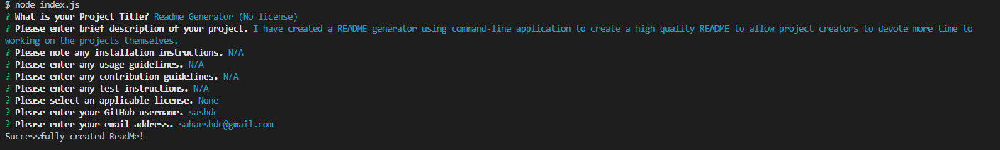

#  Module  : Node : Readme Generator

## Overview

I have created a README generator that uses the command-line application to create a high quality README to allow project creators to devote more time to working on the projects themselves.

## Installation

NodeJS and a command line application will be needed to use the product.

## Usage

The applicaiton is run by runnning <node index.js> in the CLI when in the appropriate directory.

The final output is the readme.md file in the same directory.

### Links

 [Github Repo](https://github.com/sashdc/readme-generator)
 [Walkthrough Video](https://drive.google.com/file/d/1yfigcBVjU7vlJwPy5AJsxEXcV2X_qPmW/view)

 ## Credits

Cherian, Saharsh

[Creator Github](https://github.com/sashdc)

## License

N/A